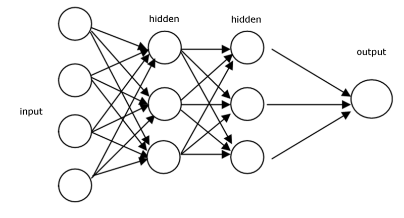
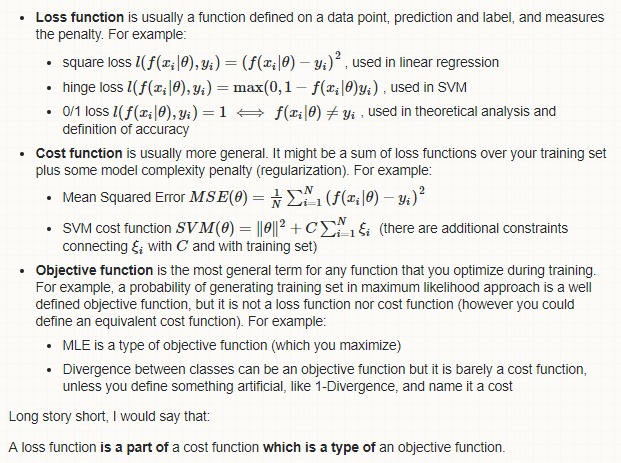
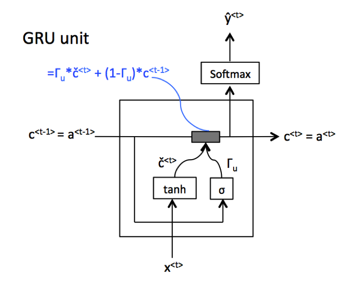
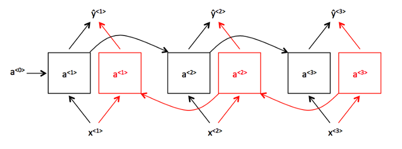

# Recurrent Neural Networks
#### Overview of Feed-forward Neural Networks (FFNN)
#### Recurrent Neural Networks (RNN)
#### Vanilla RNN architecture
#### Backpropagation/Backpropagation through time (BPTT)
#### Gated Recurrent Unit (GRU) architecture
#### Bidirectional RNN
#### Application areas
#### Examples
#### References

# Overview of Feed-forward Neural Networks (FFNN)

This is the diagramm of a vanilla FFNN. In FFNN, input is taken, weights are applied and through some hidden layers, some other weights are applied and finally some output is generated, whether it is a 'yes' or 'no' type of binary classification or rather number classification, etc. There's no way that input `x<t>` to be affected by `x<t-1>`, therefore it means each input is independent. For example, in CNN, evaluation of any pixel isn't affected by its neighbors. For FFNNs it is said that they don't have any internal state - memory.

But what's the problem of not having a state? What kind of issues might it have? Let's look at an example.

`Jane called John` and `John called Jane`. These are 2 different sentences even though they share the same set of words. In the former, subject of the sentence is Jane, but in the latter it is John. Therefore, their order matters here and if we change it, it might alter the meaning or even cause some logical inconsistency. Hence, **ORDER MATTERS**

Another example. Translating from one language to another. For instance, when we translate a sentence `My name is Jane` from English to German it becomes `Mein name ist Jane`. As you can see they have the same number of words and the same order of subject, verb, etc. This is because English and German have some similarities. However, that's not always the case, if you translate the same sentence to Russian that would be `Меня зовут Джейн` which has the same interpretation as its English counterpart, but with less words and also relatively different literal meaning (It means 'They call me as Jane'). Here as you can see, apart from order also the semantics(also context) matter.

Vanilla NNs cannot solve those issues because they treat each input invidually. There's no co-relation between inputs

# Recurrent Neural Networks (RNN)
#### What issues does RNN solve?
RNNs on the other hand, solve these types of issues. They are used for **sequence** type of data.

What is sequence data anyway? It's the sequence(or stream) of data that's dependent on each other (maybe on previous streams, maybe on both previous and future streams). In any type of conversation, the word order is dependent on the context. Let's say there's a sentence as follows : `I drink _____`. Logically, we can deduce that we can use any kind of beverage to fill in the blank. Or we can use any time related adverb. So both `I drink water` and `I drink everyday` are logically correct but depending on the context one might sound much appropriate.

Speech to text process on the other hand is a sequence type of data processing. Because, the sound is converted into words and those words must make sense in the context. For example, `pair` and `pear` or `read`(past) and `red` sound exactly the same. The chosen word is closely connected to the previous(and future) inputs.

#### Vanilla RNN Architecture

*source : http://www.deeplearningbook.org/contents/rnn.html*

Let's take a close look at the diagram above. The NN on the left is the regular, vanilla RNN. Recurrent structure of it is represented via an arrow that starts from the hidden layer and return to it. The black square basically means that it represents the previous state. If we examine the diagramm on the left, we can see that it gets some input `x` and `U` weight matrix is applied to it, then there's an  output `o` which is multiplied by `V` and finally another arrow that goes out and comes in which is multiplied by `W`. `L` represents the loss. The diagramm on the left is not really straightforward, we cannot see what's going on. In order to see really what's happening, we have to **unfold(or unroll)** the network.
When we unroll the network, we see a similar structure as FFNNs and essentially, RNNs are similar to FFNNs if they are unrolled except for doing different tasks in hidden layers.

The formula below represents the state `h<t>` in RNNs. As you can see `h<t>` is influenced by both `h<t-1>` that is previous state and `x<t>` which is the input. The arguments/parameters of the function is represented via `theta`.

*source : http://www.deeplearningbook.org/contents/rnn.html*

These are the formulas that govern RNNs. Of course, in real world, variations of and some additions to these formulas are used. 

Here:

- `a` is the activation value
- `h` is the state
- `o` is the output when bias and some weights applied
- `y` is the true output of the network

*source : http://www.deeplearningbook.org/contents/rnn.html*

#### Parameter sharing

Another plus of the RNNs is that they share parameters. What is parameter sharing? In any deep neural networks, there are multiple layers and each layer has different number of neurons. All these neurons together form a lot of parameter for the network. Because the input layer might have `n` number of neurons, while next 3 hidden layers can have `m`, `l`, `k` number of neurons respectively. 
However, in RNNs, since there's a recurrent architecture, they share the same parameters, hence it reduces the total number of parameters in the network

#### Backpropagation Through Time (BPTT)
For any NN we use the phrase 'learning'. 'Learning' means the network figures out how to interpret the given input based on some calculations and expected outputs and the weights are adjusted. In order to understand backpropagation, we need a loss function, that is, let's say `Crossentropy Loss function`:

This is overall loss (cost function). In each time step in forward propagation the loss is calculated and accumulated(summed up or averaged). After that, the backpropagation starts and applied weights and biases are changed. By changing, I mean,using for example, **negative stochastic gradient descent**, network tries to find the best combinations of weights and biases to decrease the **cost function** (basically the sum of loss functions + some regularization). The reason why we use negative gradient descent is that, normally gradient shows where's the steepest increase for the given function.

Here's the explanation about loss, cost and objective functions.

*[https://stats.stackexchange.com/users/28903/lejlot](https://stats.stackexchange.com/users/28903/lejlot)*

It is basically, the information that each output sends to the weights that how much they need to be adjusted in order to get the desired results.

"Through Time" extension in BPTT essentially refers to moving in opposite direction of the sequence.

#### Vanishing gradient

Vanishing gradient is one of most problematic issues in the RNN architecture. We said that RNN deals with sequence of inputs and we mentioned that those inputs are interdependent. However, in vanilla RNNs, an input in the beginning of the sequence will probably lose its affectiveness to the output in the end of the network (or after some sequence of inputs). Because when backpropagating, gradient will lose its affect from back to front. The basic example would be as such:

`The cat that ate everything today was full`. Here the network has to remember that 'cat' is singular and the corresponding verb should be singular as well. But while backpropagating, it's really hard for the network to keep its effect. It is said that vanilla RNNs have problems with **long term dependencies**

### Gated Recurrent Unit

Here's the general overview of the GRU unit. It's the hidden layer's architecture. What's happening here?
As we mentioned vanilla RNNs are not good at 'long term dependencies' and GRUs address these type of probems and try to solve them. In the picture, `gamma<u>` is the result of `sigmoid` function which squashes the value to (0;1) interval. Based on `gamma<u>` value, it is decided that whether `c<t>` is updated (or how much does it change). If we consider `gamma<u>` to be either 0 or 1, that will tell the network to update `c<t>` or to use the previous value. What this basically means is that network can remember that the `cat` was singular, so it has to use `was` instead of `were`.

*Source : Andrew Ng's deeplearning.ai*

These are the formulas that govern GRU.

 - `chat<t>` is the new cell candidate. It will replace the existing cell value `c<t-1>` if needed. `tanh` activation is applied here
 - `gamma<u>` means how much to update the cell value. Since `sigmoid` is applied, its value will be in (0; 1) interval.
 - `c<t>` is the cell value. In the formula, as we can see, based on the `gamma<u>` value, it is decided that whether cell value should be updated

*Source : Andrew Ng's deeplearning.ai*

### Bidirectional RNN

Before learning about BRNN, let's look at an example. This example is taken from [Andrew Ng's Sequential Models](https://www.coursera.org/learn/nlp-sequence-models) course.

As we previously see in GRU, sometimes we need to remember some dependencies for a long term. So, it means an input can influence another further input's output. But sometimes, not only the previous ones, but also later inputs can affect the previous ones. For example:

`He said 'Teddy Roosevelt is the President of USA'`

`He said 'Teddy bears are cool'`

Here in order to understand whether the token(word, string) `Teddy` is a name or just another noun we have to be aware of the context. Therefore, again, vanilla RNNs aren't able to solve the problem.

Here's the architecture of bidirectional RNN in the unfolded form. Basically what happens here is that, the output `yhat<t>` is affected by both activations `a<t>` in forward  (or `A`) direction and `a<t>` in the backward (or `A'`) direction

*Source : [Chris Olah's blog](http://colah.github.io/)*

## Applications Area of RNNs

- Machine Translation
- Robot control
- Time series prediction
- Speech recognition
- Time series anomaly detection
- Rhythm learning
- Music composition
- Grammar learning
- Handwriting recognition
- Human action recognition
- Protein Homology Detection
- Predicting subcellular localization of proteins
- Several prediction tasks in the area of business process management
- Prediction in medical care pathways

# Examples

# References
 - [The Unreasonable Effectiveness of Recurrent Neural Networks by Andrew Karpathy](http://karpathy.github.io/2015/05/21/rnn-effectiveness/)
 - [Recurrent Neural Networks Tutorial, Part 1 – Introduction to RNNs by Denny Britz](http://www.wildml.com/2015/09/recurrent-neural-networks-tutorial-part-1-introduction-to-rnns/)
 - [Unfolding RNNs by Suriyadeepan Ram](http://complx.me/2017-01-07-unfolding-rnn/)
 - [Understanding LSTM Networks by Christopher Olah](http://colah.github.io/posts/2015-08-Understanding-LSTMs/)
 - [Harrison Kinsley a.k.a. Sentdex Youtube Channel](https://www.youtube.com/user/sentdex)
 - [Machine Learning Mastery Character Level Text Generation](https://machinelearningmastery.com/text-generation-lstm-recurrent-neural-networks-python-keras/)
 - [Machine Learning Mastery Word Level Text Generation](https://machinelearningmastery.com/how-to-develop-a-word-level-neural-language-model-in-keras/)
